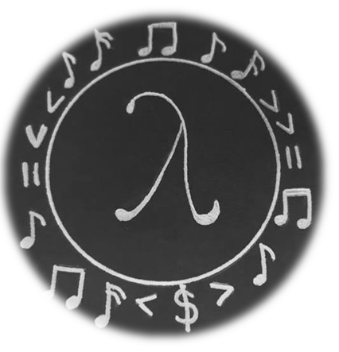

#  AlgoRhythm
### A Haskell library for algorithmic music composition

* [Soundcloud](https://soundcloud.com/algo-rhythm-haskell/sets)
* [Report](https://github.com/omelkonian/AlgoRhythm/blob/master/report/report.pdf)
* [Presentation](https://github.com/omelkonian/AlgoRhythm/blob/master/presentation/presentation.pdf)
